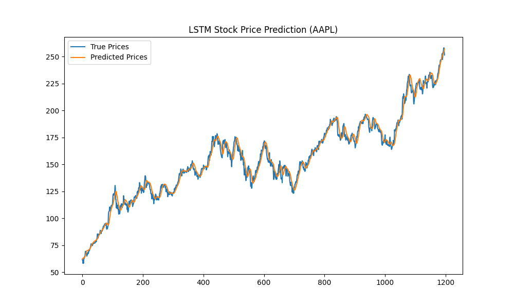

# AI Stock Prediction Model

An AI-based time-series forecasting project using **LSTM neural networks** to predict stock prices.  

## Features
- Data preprocessing (scaling, sequence creation, train/test split)
- LSTM model architecture for time-series forecasting
- Comparison with ARIMA baseline
- Visualization of predictions vs. actual stock prices
- Reproducible training pipeline with TensorFlow/Keras

## Tech Stack
- **Languages:** Python (3.10+)
- **Libraries:** TensorFlow, Keras, Pandas, NumPy, Matplotlib, Scikit-learn, Statsmodels


## Setup
1. Clone the repo:
   ```bash
   git clone https://github.com/yourusername/AI_Stock_Prediction_Model.git
   cd AI_Stock_Prediction_Model

2. Create and activate a virtual environment:
   ```bash
   python -m venv venv
   venv\Scripts\activate      # Windows

3. Install Dependencies
   ```bash
   pip install -r requirements.txt

## How to Run
Run the scripts step by step:
1. Fetch stock data
   ```bash
   python -m src.fetch_data

2. Preprocess the data
   ```bash
   python -m src.preprocess

3. Train the LSTM model
   ```bash
   python -m src.train

4. Evaluate and visualize predictions
   ```bash
   python -m src.evaluate

## Note:
Default ticker: AAPL (Apple Inc.)
You can change the stock ticker in src/fetch_data.py.
Model is saved in models/lstm_stock_model.h5.


## Example output

